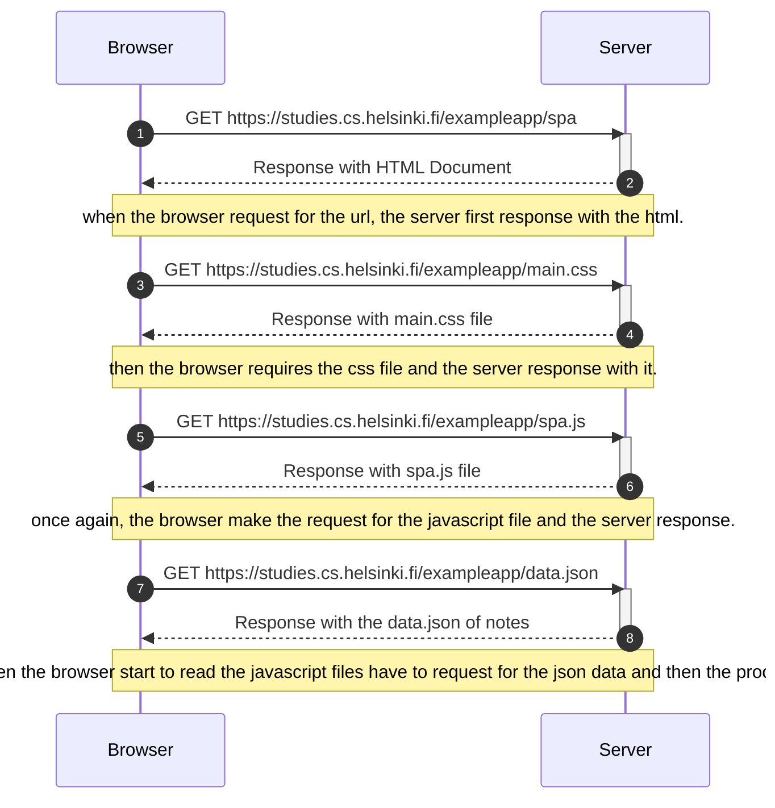

```mermaid
    sequenceDiagram
    participant B as Browser
    participant S as Server
    autonumber

    B->>S: GET https://studies.cs.helsinki.fi/exampleapp/spa
    activate S
    S-->>B: Response with HTML Document
    deactivate S
    Note over B,S: when the browser request for the url, the server first response with the html.

    B->>S: GET https://studies.cs.helsinki.fi/exampleapp/main.css
    activate S
    S-->>B: Response with main.css file
    deactivate S
    Note over B,S: then the browser requires the css file and the server response with it.

    B->>S: GET https://studies.cs.helsinki.fi/exampleapp/spa.js
    activate S
    S-->>B: Response with spa.js file
    deactivate S
    Note over B,S: once again, the browser make the request for the javascript file and the server response.

    B->>S: GET https://studies.cs.helsinki.fi/exampleapp/data.json
    activate S
    S-->>B: Response with the data.json of notes
    deactivate S
    Note over B,S: finally, when the browser start to read the javascript files have to request for the json data and then the process ends.
```
